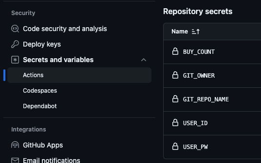
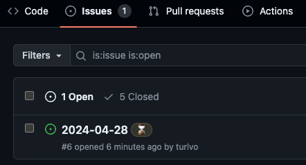
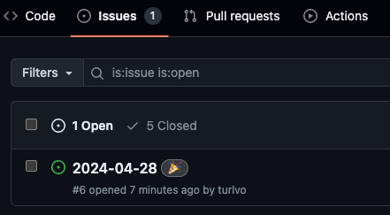
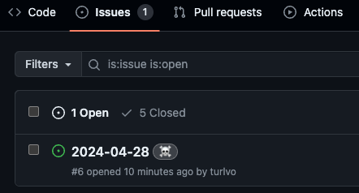

# Buying the lottery automatically through GitHub Actions

- https://dhlottery.co.kr/ 동행복권 홈페이지
- public 으로 공유할 수 있게 모든 민감 정보 action secrets 값으로 관리
- Github issue로 구매/결과 관리
- **_예치금 필요합니다._**

## GETTING START
 
#### 1. `fork`를 한다!

#### 2. `fork`한 repo를 `git clone` 한다.

#### 3. `action.yml` 파일을 보면 gitaction 시크릿값을 python run 인자로 넘길때 사용하고 있다. 즉 시크릿값만 세팅하면 된다.

#### 4. 시크릿값은 아래 사진 참고

- GIT_OWNER는 Github id
- GIT_REPO_NAME은 지금 repository 명 ex) `auto-lotto-gitaction`
- BUY_COUNT가 구매할 복권 수 세팅 값이다.
- 그 외 user값은 https://dhlottery.co.kr/common.do?method=main 여기 회원가입한 정보를 넣자. **_절대 절대 절대 노출 안되게 조심_**

#### 5. 위 세팅 완료 후 test를 위해 `action.yml` 에서 `on: [push]` 로 바꾸고 push를 해보자

- 구입 완료 / 에러시에 `Issues`에 새로운 issue가 등록 된다

#### 6. `action-result.yml` 은 이제 발표된 추첨 번호를 Github Issue에 등록된다. 20시 35분경 발표가 나는 점, 업데이트가 나중에 되는점을 참작해 21시 50분경에 러닝하게 했다.

- 추첨 결과를 Issue Label로 추가해줌
- 하나라도 당첨시 🎉, 낙첨시 ☠️

## To develop something more in the local

1. 가상환경 구성을 추천한다. 편한대로 구성하면 된다, ex. `python3 -m venv .venv`
2. `requirements.txt` file을 install 한다.
3. `playwright install` 를 해준다. 기본 준비 끝 - https://playwright.dev/
4. 디버깅 모드 셀레니움이 익숙한 사람은 그렇게 사용해도 무방하다.

## TODO

- [ ] 당첨 결과 조회를 action 수행 기준일로만 처리하는데, Issue title에 날짜로 처리하도록 수정

## STACK

- python
  - python 3.8+
  - Playwright & selenium (chrome driver)
  - requests
- lint: flask8 & black
- github action (action.yml)

---
